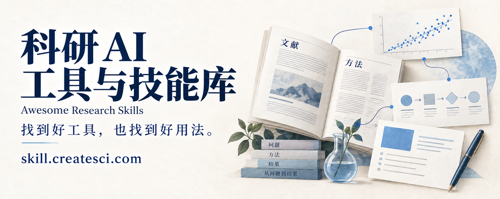
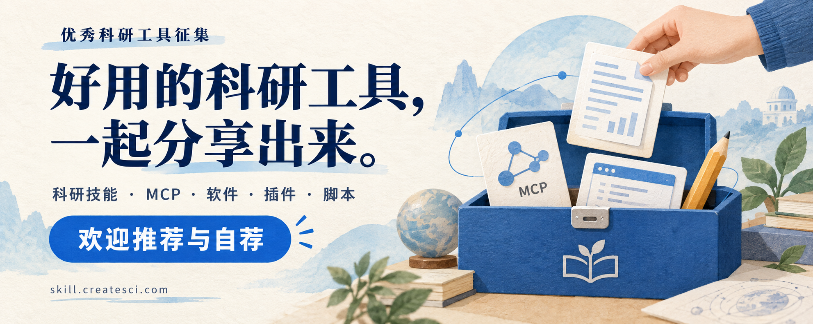

<!-- Generated by scripts/build.py. Edit data or the renderer, then rebuild. -->

# 科研 AI 工具与技能库

Awesome Research Skills · 按科研任务整理的工具清单与使用方法

**科研遇到问题，先找到能帮忙的 Skill。**

### [在线网站：skill.createsci.com](https://skill.createsci.com/)

在网站上按科研任务查找工具、阅读使用指南和实践案例；在这里查看项目来源、提交补充和跟进教程计划。

这里收录能帮助 AI 完成任务的技能、连接外部软件的服务，以及可以直接使用的科研工具，覆盖查文献、读论文、分析数据、制作科研图和操作专业软件。先按任务找到工具，再按原作者文档使用。

[访问网站](https://skill.createsci.com/) · [使用指南](https://skill.createsci.com/guides) · [实践案例](https://skill.createsci.com/cases) · [教程计划](TUTORIALS.md) · [贡献资源](CONTRIBUTING.md)

## 征集：把你做过、用过的好工具分享出来

你有没有做过一个能省下重复劳动的科研工具，或用过一个想推荐给同行的项目？欢迎来这里分享。

**科研 AI 技能（Skill）、工具连接服务（MCP）、桌面软件、在线工具、插件、脚本和工作流，都欢迎。** 查文献、读论文、分析数据、画科研图、准备汇报、操作专业软件，只要能解决一个具体问题，就值得介绍。

欢迎作者自荐，也欢迎使用者推荐。投稿只需写清楚：**项目叫什么、链接在哪里、能解决什么问题**。如果有使用截图、示例结果或上手教程，也欢迎一起附上；尚未实测请如实说明。

我们会核对项目来源与用途，收录时保留原项目链接和来源信息，尊重作者署名与许可。有完整实践记录的项目，也欢迎参与后续教程和案例共建。

**[推荐／自荐一个工具](https://github.com/ZMoe2024/awesome-research-skills/issues/new?template=add-resource.yml)** · [查看投稿说明](CONTRIBUTING.md) · [分享教程选题](https://github.com/ZMoe2024/awesome-research-skills/issues/new?template=tutorial.yml)

**[查看资源清单](lists/all.md)**：311 项资源，另有 5 条候选与待核验记录。按具体项目或工具条目整理，用途与可用性以原项目文档为准。

## 全部目录

- [AI 技能清单（Skill）](#skills)：106 项，含同时提供工具连接的项目。
- [工具连接服务（MCP）](lists/mcp.md)：132 项。
- [其他科研工具](lists/tools.md)：37 项。
- [科研工作台与智能助手](lists/workspaces.md)：11 条。
- [研究模板](lists/templates.md)：1 条。
- [设计、传播与其他延伸工具](lists/related.md)：24 条。
- [候选与待核验记录](lists/review.md)：5 条。

前三份清单对应网站展示的 275 项，并补充科研工作台、研究模板和延伸工具。不同分组不重复计数。

## 从这里开始

1. 找到下面与你当前任务对应的分类，或先看一个专题。
2. 打开资源链接，确认项目功能、依赖、费用与客户端要求。
3. 用一份小样本试跑，核对输出，再放进自己的科研流程。

### 不熟悉这些名称？

| 名称 | 用来做什么 | 例子 |
| --- | --- | --- |
| AI 技能（Skill） | 给 AI 一套完成任务的步骤与规则，有时附带脚本或模板 | 按固定要求读论文、检查引用、整理汇报 |
| 工具连接服务（MCP） | 让支持的 AI 客户端访问外部软件或数据 | 查询文献库、调用统计软件 |
| 智能助手（Agent） | 结合指令和工具推进多步任务 | 查找资料、整理文件，再生成初稿 |
| 命令行工具（CLI） | 通过终端命令运行的软件 | 批量转换 PDF、导出数据 |

先读每个项目后面的中文用途，再决定是否打开原项目。英文项目名保留原写法，方便搜索和核对；具体配置要求以各自文档为准。

## 科研专题

- [把论文 PDF 变成可用资料](topics/paper-pdf.md) — 从 PDF 到可检索文本、公式和参考文献。按材料类型选工具，并检查提取结果。
- [把一篇论文讲清楚](topics/lab-meeting.md) — 从研究问题到方法图，再到可编辑幻灯片。带着明确提纲选工具，保留修改空间。
- [让数据分析有据可查](topics/research-data.md) — 从整理变量到选择统计方法，再到保存分析过程。按你的操作习惯挑选入口。

## 教程征集与计划

**你跑通过的方法、踩过的坑，也能帮后来的人少走弯路。** 欢迎投稿原创教程、推荐优秀教程，或分享一次完整的科研工具实操。图文、视频、代码笔记（Notebook）、软件上手指南都可以，围绕 Skill、MCP、科研软件或具体研究任务展开。

介绍教程讲什么、适合谁，再附上正文或原文链接即可。如果有样本、步骤、结果和排错记录，也欢迎一起分享。我们会核对来源与内容，保留作者署名和原文链接；未验证的步骤会如实说明。

**[投稿／推荐一篇教程](https://github.com/ZMoe2024/awesome-research-skills/issues/new?template=tutorial.yml)** · [提出想看的选题](https://github.com/ZMoe2024/awesome-research-skills/issues/new?template=tutorial.yml) · [查看教程征集说明与计划](TUTORIALS.md)

已有指南与案例可以直接阅读，后续教程按下面的顺序准备，也欢迎参与共建。

| 内容 | 状态 | 入口或目标 |
| --- | --- | --- |
| 一段话，让 AI 来本站找工具 | 已有使用指南 | [在线阅读](https://skill.createsci.com/guides/use-this-site) |
| 一篇论文 → 带页码笔记与组会提纲 | 已有样本案例 | [查看案例与文件](https://skill.createsci.com/cases/attention-paper-notes) |
| 文献检索与 PDF 整理 | 计划中 | 从题名或 DOI 清单得到可核对的文献记录与归档文件 |
| 论文 PDF 解析与表格核对 | 计划中 | 完成一个解析工具的配置、小样本运行与原页对照 |
| 组会汇报与科研图 | 计划中 | 从论文和提纲制作可编辑图与幻灯片 |
| 数据分析与结果复现 | 计划中 | 从样本数据生成结果表、图和可重复运行的记录 |

[查看完整教程计划、已有内容与投稿方式](TUTORIALS.md)。计划中的教程尚未发布，完成样本运行和结果核对后再提供正文入口。

## 让 AI 帮你挑

复制下面这段话，把最后一句换成你的问题。支持读取仓库或联网的 AI 可以据此查找；无法读取时，可将相关清单内容一起提供。

> 请从这个 Awesome Research Skills 仓库的 lists/all.md 和 topics 中，为我的科研任务寻找合适的工具。需要检索结构化信息时读取 data/full-catalog.json。优先给出 1–3 个匹配项，说明用途、原项目链接、使用条件和第一步操作；先核对原项目文档，不要编造功能、安装命令或已测试结论。注意条目的分组与状态，不将历史需求缺口当成工具。如果没有合适的收录，请明确说明。我的任务是：【在这里写下你的问题】。

## AI 技能清单（Skill）

[文献研究](#literature) · [论文读写](#writing) · [数据分析](#data) · [图表展示](#figures) · [专业软件](#software) · [生医实验](#biomed) · [知识协作](#knowledge) · [通用科研](#general)

类型与用途沿用现有目录记录，尚未逐项重新实测。`目录来源` 表示当前链接指向第三方目录，原项目地址仍待核实；这些条目保留供检索，不作为已确认的推荐。其他链接也不等于经过运行验证。

### 文献研究（17）

- [academic-research-agent-skill](https://github.com/ngtiendong/Academic-Research-Agent-Skill) — 文献基础、创新性检查、数学表述与实验规划 `[AI 技能（Skill）]`
- [ai-research-skills](https://github.com/WenyuChiou/ai-research-skills) — Zotero/NotebookLM/多 CLI 研究流程；输出文献筛选/研究设计/手稿。 `[AI 技能（Skill）]`
- [asta-skill](https://github.com/Agents365-ai/asta-skill) — Semantic Scholar/Asta MCP 包装；输出论文检索/作者/引用网络。 `[AI 技能（Skill）]`
- [claude-code-zotero-skill](https://github.com/shoei05/claude-code-zotero-skill) — DOI 批量导入、collection 管理、item search；输出Zotero 条目/collection。 `[AI 技能（Skill）]`
- [cnki-skills](https://github.com/cookjohn/cnki-skills) — 知网检索、期刊浏览、PDF 下载、Zotero 导出；输出PDF/引用/Zotero 条目。 `[AI 技能（Skill）]`
- [Google Scholar 统一检索](https://github.com/cookjohn/gs-skills) — Google Scholar 检索、引用追踪、全文访问、Zotero 导出；输出论文列表/引用/全文/Zotero。 `[AI 技能（Skill）]`
- [ieee-skills](https://github.com/cookjohn/ieee-skills) — IEEE Xplore 检索、引用、PDF、Zotero；输出IEEE 文献/引用/PDF。 `[AI 技能（Skill）]`
- [lit-review-skill](https://github.com/Zachariah9420/lit-review-skill) — 查找支撑文献，审计引用真伪和论据支持度 `[AI 技能（Skill）]`
- [LitReviewSkill](https://github.com/Zsun79/LitReviewSkill) — 组织迭代检索与文献综述工作流 `[AI 技能（Skill）]`
- [paper-fetch](https://github.com/Agents365-ai/paper-fetch) — DOI/title 到 PDF，多来源 fallback；输出PDF/元数据。 `[AI 技能（Skill）]`
- [pm-skills](https://github.com/cookjohn/pm-skills) — PubMed 检索、引用导出、Zotero 集成；输出PubMed 文献/引用。 `[AI 技能（Skill）]`
- [ScanSci PDF（scansci-pdf）](https://github.com/Rimagination/scansci-pdf) — 根据 DOI、arXiv 编号或文献清单批量获取论文全文，并通过已有机构权限下载订阅内容、整理引文和归档到 Zotero `[AI 技能 + 工具连接（Skill + MCP）]`
- [semanticscholar-skill](https://github.com/Agents365-ai/semanticscholar-skill) — Semantic Scholar API wrapper；输出论文/引用/作者数据。 `[AI 技能（Skill）]`
- [skill-endnote-research](https://github.com/GuangyaoYin/skill-endnote-research) — 研究想法转 EndNote 文献包；输出文献包/文件夹/综述材料。 `[AI 技能（Skill）]`
- [video-moment-retrieval-research-radar](https://github.com/tianxinlin666/video-moment-retrieval-research-radar) — 跟踪 Video Moment Retrieval 研究前沿；输出论文雷达/benchmark/leaderboard。 `[AI 技能（Skill）]`
- [yy/claude-scholar](https://github.com/yy/claude-scholar) — 提供文献元数据、引用检查、LaTeX 清理、数学推导验证和 arXiv 投稿准备等学术小工具。 `[AI 技能（Skill）]`
- [zotero-obsidian-skill](https://github.com/WindZh03/zotero-obsidian-skill) — 读取 Zotero 分类论文，写入 Obsidian notes；输出Markdown 笔记。 `[AI 技能（Skill）]`

### 论文读写（20）

- [academic-paper-skills](https://github.com/lishix520/academic-paper-skills) — 论文规划与写作框架；输出论文大纲/章节草稿/检查点。 `[AI 技能（Skill）]`
- [Academic-Paper-Skills](https://github.com/DELONG-L/Academic-Paper-Skills) — 论文写作、图表和审查工作流 `[AI 技能（Skill）]`
- [academic-rebuttal-manager](https://mcpmarket.com/tools/skills/academic-rebuttal-manager) — Academic Rebuttal Manager 帮研究生把审稿意见拆成任务清单，生成逐条回复、修订计划和核验清单。 `[AI 技能（Skill） · 目录来源]`
- [academic-writing-skills](https://github.com/bahayonghang/academic-writing-skills) — 已有论文的格式检查、语言修改和引用核验 `[AI 技能（Skill）]`
- [agent-research-skills](https://github.com/lingzhi227/agent-research-skills) — 系统文献综述与研究流程；输出综述/实验设计/PPT。 `[AI 技能（Skill）]`
- [ARIS rebuttal skill](https://github.com/wanshuiyin/Auto-claude-code-research-in-sleep/blob/main/skills/rebuttal/SKILL.md) — ARIS rebuttal skill 解析外部审稿意见，强制覆盖和 grounding，生成安全文本回复与修订核对表。 `[AI 技能（Skill）]`
- [codex-claude-academic-skills](https://github.com/zLanqing/codex-claude-academic-skills) — 论文阅读报告、PPT/Word、写作润色、科学计算；输出Word/PPT/图表/论文文本。 `[AI 技能（Skill）]`
- [consensus-research-skill](https://github.com/Drignacioalcala/consensus-research-skill) — 帮研究生把证据检索变成综述草稿、阅读清单和 Word 输出。 `[AI 技能 + 工具连接（Skill + MCP）]`
- [dailypaper-skills](https://github.com/huangkiki/dailypaper-skills) — 论文流水线、日更论文、读写一体；输出论文笔记/日报/流水线文件。 `[AI 技能（Skill）]`
- [DeepPaperNote](https://github.com/917Dhj/DeepPaperNote) — 单篇论文深读并生成 Obsidian 笔记；输出深度论文笔记。 `[AI 技能（Skill）]`
- [latex-arxiv-SKILL](https://github.com/appautomaton/latex-arxiv-SKILL) — LaTeX论文流程与BibTeX引用核验 `[AI 技能（Skill）]`
- [Nature-Paper-Skills](https://github.com/Boom5426/Nature-Paper-Skills) — Nature 投稿全流程：初稿、引用、Data Availability、返修；输出投稿检查/回复信/修订稿。 `[AI 技能（Skill）]`
- [nature-skills](https://github.com/Yuan1z0825/nature-skills) — Nature 风格写作、润色、读论文、绘图、返修；输出润色文本/图表/PPT/回复信。 `[AI 技能（Skill）]`
- [orchestra-research/ai-research-skills](https://github.com/orchestra-research/ai-research-skills) — AI research/engineering skills；输出研究工作流/训练脚本/论文。 `[AI 技能（Skill）]`
- [PaperSpine](https://github.com/WUBING2023/PaperSpine) — 帮研究生把论文/报告写作从“润色一句话”升级成可审计工作流：先学目标期刊/会议和强论文，再生成动机、证据、引文、改写矩阵与 LaTeX/Word/PDF 产物。 `[AI 技能（Skill）]`
- [research-paper-lifecycle-skills](https://github.com/ShaishavMaisuria/research-paper-lifecycle-skills) — 检索、写作、投稿、返修和报告技能集合 `[AI 技能（Skill）]`
- [scholar-deep-research](https://github.com/Agents365-ai/scholar-deep-research) — 8 阶段文献综述、去重、引用追踪、自评；输出综述报告/证据表。 `[AI 技能（Skill）]`
- [texra-scientific-skills](https://github.com/texra-ai/texra-scientific-skills) — 科学写作、审稿与科研图工作流 `[AI 技能（Skill）]`
- [thesis-creator](https://github.com/Stars-OC/thesis-creator) — 论文生成、ER 图、流程图、降重；输出论文/ER图/流程图。 `[AI 技能（Skill）]`
- [论文X光机 / ljg-skill-xray-paper](https://github.com/lijigang/ljg-skill-xray-paper) — 解构论文、提炼核心公式/贡献；输出论文结构拆解/餐巾纸公式。 `[AI 技能（Skill）]`

### 数据分析（19）

- [Auto-claude-code-research-in-sleep / ARIS](https://github.com/wanshuiyin/Auto-claude-code-research-in-sleep) — 睡觉时自动研究、idea、实验、审稿循环；输出idea/实验记录/论文草稿。 `[AI 技能（Skill）]`
- [canvas-mcp](https://github.com/vishalsachdev/canvas-mcp) — Canvas MCP 连接 Canvas LMS/Gradescope，支持课程、作业、模块、日历、评分和学生数据查询。 `[AI 技能 + 工具连接（Skill + MCP）]`
- [causal-inference-mixtape](https://github.com/Jill0099/causal-inference-mixtape) — DID、RDD、IV、Synthetic Control、Matching；输出因果推断代码/解释。 `[AI 技能（Skill）]`
- [Claude-Code-Skills-for-Academics](https://github.com/aspi6246/Claude-Code-Skills-for-Academics) — 给学术实证金融工作流的技能集合：R 计量、数据 profiling、论文编辑、审稿、Beamer 和教学同步。 `[AI 技能（Skill）]`
- [claude-code-skills-social-science](https://github.com/sshtomar/claude-code-skills-social-science) — DID、RCT、回归诊断、可视化、综述；输出模型代码/诊断/图表。 `[AI 技能（Skill）]`
- [econ-r-mcp](https://github.com/emmanueltsallis/econ-r-mcp) — 通过R执行可复现计量分析并保存结果 `[AI 技能 + 工具连接（Skill + MCP）]`
- [Economist Analyst](https://mcpmarket.com/tools/skills/economist-analyst-1) — Economist Analyst skill 用供需、博弈、激励和多学派框架分析经济事件。 `[AI 技能（Skill） · 目录来源]`
- [education-agent-skills](https://github.com/GarethManning/claude-education-skills) — Education Agent Skills Library 提供 131 个基于证据的教育 skill，支持 Claude、Codex 和 MCP 连接。 `[AI 技能 + 工具连接（Skill + MCP）]`
- [faostat-skills](https://github.com/berba-q/faostat-skills) — FAOSTAT 食品农业数据分析；输出国家画像/贸易分析/气候评估。 `[AI 技能（Skill）]`
- [irt-psychometrics-edu](https://skillsmp.com/skills/xjtulyc-awesome-rosetta-skills-skills-20-education-irt-psychometrics-edu-skill-md) — irt-psychometrics-edu skill 用于教育测量 IRT：2PL/3PL 校准、DIF、信息函数和测验等值。 `[AI 技能（Skill） · 目录来源]`
- [MathModeling-skills](https://github.com/KyrieZhang329/MathModeling-skills) — 分阶段建模流程、Python/MATLAB/北太天元；输出模型/代码/论文。 `[AI 技能（Skill）]`
- [qualitative-coding-workflow](https://mcpmarket.com/tools/skills/qualitative-coding-workflow-1) — Qualitative Coding Workflow skill 编排批量文档编码、理论/经验双流分析、解释暂停和审计轨迹。 `[AI 技能（Skill） · 目录来源]`
- [research-data-explorer](https://github.com/u9401066/research-data-explorer) — 保存分析过程与报告证据的探索性数据分析 `[AI 技能 + 工具连接（Skill + MCP）]`
- [rstudio-reviewer](https://github.com/enrico1c/rstudio-reviewer) — RStudio 代码审查、模型设定、可复现性；输出审查报告/修复建议。 `[AI 技能（Skill）]`
- [sem-guide](https://skillsauth.com/skills/wentorai/sem-guide) — sem-guide skill 指导用 R lavaan / Python semopy 构建、估计和解释结构方程模型。 `[AI 技能（Skill）]`
- [stata-graphics-skill](https://github.com/YoungFujun/stata-graphics-skill) — Stata 期刊级作图；输出Stata 图表代码/图形。 `[AI 技能（Skill）]`
- [stata-help-skill](https://github.com/ashuiGordon/stata-help-skill) — 帮经管社科研究生查 Stata 命令语法、选项和示例，减少 do-file 幻觉。 `[AI 技能 + 工具连接（Skill + MCP）]`
- [stata-skill](https://github.com/dylantmoore/stata-skill) — Stata 正确代码、数据管理、计量、因果推断、作图；输出do-file/模型/图表。 `[AI 技能（Skill）]`
- [wjx-ai-kit / wjx-mcp-server](https://www.wjx.cn/help/help.aspx?catid=136) — 问卷星官方 wjx-ai-kit 提供 CLI、SDK、MCP Server、Agent 和 Skill，让 AI 用自然语言创建问卷、查询结果和分析数据。 `[AI 技能 + 工具连接（Skill + MCP）]`

### 图表展示（12）

- [academic-figures-drawer](https://github.com/M1n-n9/academic-figures-drawer) — 将方法说明变成可编辑科研图 `[AI 技能（Skill）]`
- [academic-ppt-master](https://github.com/M1n-n9/academic-ppt-master) — 论文转可编辑学术PPTX `[AI 技能（Skill）]`
- [beamer-skill](https://github.com/Noi1r/beamer-skill) — 生成、编译、审阅和打磨学术 Beamer 幻灯片，并可配合 pdf-mcp 抽取论文图。 `[AI 技能 + 工具连接（Skill + MCP）]`
- [claude-skill-academic-ppt](https://github.com/PHY041/claude-skill-academic-ppt) — 从论文 LaTeX/PDF 生成学术答辩 PPTX，含图表重绘、行动标题、speaker notes 和 Q&A 预测。 `[AI 技能（Skill）]`
- [codex-paper-figure-skill](https://github.com/pengqianhan/codex-paper-figure-skill) — 从论文内容生成可编辑draw.io图 `[AI 技能（Skill）]`
- [latex-document-skill](https://github.com/ndpvt-web/latex-document-skill) — 用自然语言生成和修复 LaTeX 文档，支持模板、OCR、TikZ、CJK/RTL 多语言和自动编译检查。 `[AI 技能（Skill）]`
- [matlab-plot-skill](https://github.com/hanlulong/matlab-plot-skill) — 修复 MATLAB 图、期刊级 subplot、PDF export；输出PDF/图表代码。 `[AI 技能（Skill）]`
- [originplot](https://github.com/deliuou/originplot-skill) — 先用 FigureSpec 描述数据、图层、绘图元素、样式和导出要求，确认后由 Windows Python 控制 Origin 批量生成图形并保存 OPJU。 `[AI 技能（Skill）]`
- [Paper2ScholarSlides](https://github.com/ficooooo/Paper2ScholarSlides) — 综述材料和模板转带引用的学术汇报 `[AI 技能（Skill）]`
- [paperbanana-skill](https://github.com/PlutoLei/paperbanana-skill) — publication-quality academic diagrams；输出学术图/Slides。 `[AI 技能（Skill）]`
- [powerpoint-skill](https://github.com/Noi1r/powerpoint-skill) — 生成包含公式与图示的PowerPoint `[AI 技能（Skill）]`
- [sci-figure-workflow](https://github.com/james20141606/sci-figure-workflow) — GPT-image/Gemini/Nano Banana/draw.io 科研绘图 4 步；输出drawio/pptx/svg。 `[AI 技能（Skill）]`

### 专业软件（11）

- [abaqus-ml-skills](https://github.com/Haibarakiku/abaqus-ml-skills) — LHS 批量数据生成、ODB 转 ML-ready CSV；输出CSV 数据集/代理模型数据。 `[AI 技能（Skill）]`
- [academic-research-skills](https://github.com/Imbad0202/academic-research-skills/blob/main/README.zh-CN.md) — research → write → review → revise → finalize；输出研究计划/文献综述/论文草稿/审稿报告/引用核验/修订稿。 `[AI 技能（Skill）]`
- [AhaDiff（知返）](https://github.com/AGI-is-going-to-arrive/ahadiff) — 使用 AI 编写科研代码后，需要理解每次改动、核对证据，并把关键知识沉淀为可复习材料 `[AI 技能 + 工具连接（Skill + MCP）]`
- [claude-skills-journalism](https://github.com/jamditis/claude-skills-journalism) — 给新闻、媒体、学术研究者的 Claude Code skills，覆盖采访、事实核查、数据新闻、网页归档和 academic writing。 `[AI 技能（Skill）]`
- [create-academic-research](https://www.npmjs.com/package/create-academic-research) — create-academic-research 一键生成适合 agent 协作的学术研究仓库。 `[AI 技能（Skill）]`
- [kicad-happy](https://github.com/aklofas/kicad-happy) — KiCad 原理图、PCB review、SPICE、BOM、制板准备；输出原理图审查/PCB 报告/BOM。 `[AI 技能（Skill）]`
- [meta-harness](https://github.com/SaehwanPark/meta-harness) — 把 Harness 思路移植到 Codex/AGENTS.md 生态，生成研究专用 skills、团队规范和确定性交接文件。 `[AI 技能（Skill）]`
- [mujoco-workbench](https://github.com/Hebbian-Robotics/mujoco-workbench) — MuJoCo 场景原型和 agent skills；输出场景 XML/仿真脚本。 `[AI 技能（Skill）]`
- [solidworks-automation-skill](https://github.com/wzyn20051216/solidworks-automation-skill) — 机械/结构研究生需要用 agent 辅助 SolidWorks 零件建模、装配体、工程图和导出 `[AI 技能（Skill）]`
- [vortex-funnel-gen](https://github.com/hooyao/vortex-funnel-gen) — CadQuery 几何 → OpenFOAM CFD → 贝叶斯优化；输出几何/CFD 结果/优化报告。 `[AI 技能（Skill）]`
- [wtf-abaqus](https://github.com/DaisyQuach/wtf-abaqus) — 仿真脚本、HPC 提交、结果验证；输出仿真脚本/提交文件/验证报告。 `[AI 技能（Skill）]`

### 生医实验（11）

- [agentic-science](https://github.com/001TMF/agentic-science) — 39 个 scientific skills，单细胞、bulk RNA-seq、wet-lab APIs；输出分析脚本/报告。 `[AI 技能（Skill）]`
- [BioMCP](https://github.com/genomoncology/biomcp) — 一个二进制 BioMCP，把 PubMed/PMC、基因、变异、疾病、药物、临床研究和本地队列分析接给 agent。 `[AI 技能 + 工具连接（Skill + MCP）]`
- [chemist](https://github.com/scaliaven/chemist) — 自然语言驱动 atomistic simulations 和 molecular dynamics；输出模拟输入/解释/报告。 `[AI 技能（Skill）]`
- [drug-discovery-skills](https://github.com/huifer/drug-discovery-skills) — target validation、ChEMBL、Open Targets、PubMed；输出靶点评估/竞品情报/文献分析。 `[AI 技能（Skill）]`
- [medsci-skills](https://github.com/Aperivue/medsci-skills) — 医学文献、报告规范、统计、出版图表；输出protocol/统计/图表/清单。 `[AI 技能（Skill）]`
- [OpenClaw-Medical-Skills](https://github.com/FreedomIntelligence/OpenClaw-Medical-Skills) — 大型医学 AI skills library；输出医学分析/报告/图表。 `[AI 技能（Skill）]`
- [pubmed-search-mcp](https://github.com/u9401066/pubmed-search-mcp) — 专业 PubMed 文献 MCP：多源搜索、全文/图表获取、PICO、时间线和 Claude skills。 `[AI 技能 + 工具连接（Skill + MCP）]`
- [Retro-Learn](https://github.com/xiaolixl/Retro-Learn) — 逆合成路线规划；输出合成路线/分析报告。 `[AI 技能（Skill）]`
- [SciAgent-Skills](https://github.com/jaechang-hits/SciAgent-Skills) — 197 个 bioinformatics/life science skills；输出分析脚本/报告。 `[AI 技能（Skill）]`
- [scientific-agent-skills / claude-scientific-skills](https://github.com/K-Dense-AI/scientific-agent-skills) — 把 100+ 科学计算、数据库检索、可视化和写作流程打包成可安装 skills，让 agent 更像科研助理。 `[AI 技能 + 工具连接（Skill + MCP）]`
- [ToolUniverse](https://github.com/mims-harvard/ToolUniverse) — 科学数据库、专业工具和研究工作流接入 `[AI 技能 + 工具连接（Skill + MCP）]`

### 知识协作（5）

- [DeepSlides group meeting skill](https://aiagentivo.com/skills/internscience-drclaw-deepslides-group-meeting-slides-generator) — DeepSlides Group Meeting Slides Generator 从论文/研究材料生成组会幻灯片，支持 Claude Code、Cursor、Codex。 `[AI 技能（Skill） · 目录来源]`
- [research-session-flow](https://github.com/whwangovo/research-session-flow) — 科研项目 init/update/status/archive/handoff/log；输出项目状态/交接/日志。 `[AI 技能（Skill）]`
- [revfactory/harness](https://github.com/revfactory/harness) — 为某个研究方向自动设计 agent 团队、角色分工、交接协议和专用 skills。 `[AI 技能（Skill）]`
- [summarize-meeting](https://smithery.ai/skills/braselog/summarize-meeting) — summarize-meeting skill 把会议转写/记录整理成摘要、行动项、决策和后续任务，支持 Codex/Claude Code。 `[AI 技能（Skill） · 目录来源]`
- [weekly-report](https://explainx.ai/skills/claude-office-skills/skills/weekly-report) — weekly-report skill 把本周成果、进行中任务、阻塞和下周计划整理成结构化周报。 `[AI 技能（Skill） · 目录来源]`

### 通用科研（11）

- [claude-legal-skill](https://github.com/evolsb/claude-legal-skill) — 合同审查 skill，基于 CUAD/LegalBench 思路做首轮合同风险识别、条款抽取和 redline 建议。 `[AI 技能（Skill）]`
- [defect-calculation](https://github.com/Xinjing-Guo/defect-calculation) — 半导体/绝缘体 VASP 点缺陷计算；输出计算输入/分析。 `[AI 技能（Skill）]`
- [DFT\_Skills](https://github.com/FonaTech/DFT_Skills) — 文献 grounded DFT & VASP workflow；输出计算输入/项目包/报告。 `[AI 技能（Skill）]`
- [Figma MCP Server Guide](https://github.com/figma/mcp-server-guide) — 官方 Figma MCP Server 让 agent 读取 Figma 设计上下文、变量、截图、Code Connect 和设计系统规则。 `[AI 技能 + 工具连接（Skill + MCP）]`
- [gee-python-skill](https://github.com/Zhihong-KE/gee-python-skill) — Google Earth Engine Python API：任务提交、Drive 下载、资产管理；输出遥感任务/下载数据/资产管理。 `[AI 技能（Skill）]`
- [qgis-automation-skill](https://github.com/Zhangyi-cug/qgis-automation-skill) — 通过 qgis\_process CLI 做空间分析；输出空间分析结果/地图。 `[AI 技能（Skill）]`
- [QGIS-Claude-Skill-Package](https://github.com/Impertio-Studio/QGIS-Claude-Skill-Package) — QGIS/PyQGIS 空间分析、制图、地理处理、插件开发；输出地图/空间分析结果/插件。 `[AI 技能（Skill）]`
- [repo-forensics](https://www.awesomeskills.dev/es/skill/alexgreensh-repo-forensics) — repo-forensics 扫描 GitHub repo、Agent Skills、Plugins 和 MCP servers 的安全风险。 `[AI 技能（Skill） · 目录来源]`
- [skill\_lammps](https://github.com/Chenghao-Wu/skill_lammps) — 编写和验证 LAMMPS input script；输出input script/验证报告。 `[AI 技能（Skill）]`
- [us-crop-monitor-skill](https://github.com/FrancyJGLisboa/us-crop-monitor-skill) — USDA NASS / 作物监测；输出作物简报/监测报告。 `[AI 技能（Skill）]`
- [vasp-pointdefect-calculation](https://github.com/yybai25/vasp-pointdefect-calculation) — VASP 点缺陷计算和 SLURM 管理；输出INCAR/POSCAR/提交脚本/结果。 `[AI 技能（Skill）]`

## 更多科研工具

- [工具连接服务（MCP）](lists/mcp.md)：132 项；兼有 AI 技能的项目已归入上面的技能清单。
- [其他工具清单](lists/tools.md)：37 项软件、CLI、工具包、插件和工作流。
- [资源总表](lists/all.md)：311 项资源与 5 条待核验记录。
- [完整 JSON 数据](data/full-catalog.json)：保留稳定 ID 与分组状态，方便检索、同步和二次整理。

## 收录与更新

初始数据快照：**2026-09-12**，整理自[科研工具网站](https://skill.createsci.com/)使用的收录库。原站展示条目中 13 项的链接仍为第三方目录中的具体工具页面，已标注，待补充原项目链接。快照日期表示整理时间；条目的原记录日期不代表最新版本、链接核验时间或测试日期。

欢迎通过 Issue 补充资源、报告失效链接，或按[贡献指南](CONTRIBUTING.md)提交 PR。收录说明、去重规则和本地检查见 [DATA.md](DATA.md)。

本仓库不镜像第三方 Skill 正文或工具源码。原项目的代码、名称、商标与文档由各自权利人持有，使用时遵循其许可。仓库原创整理内容与维护脚本采用 [MIT License](LICENSE)。
